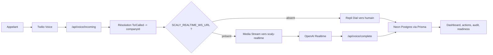

<div align="center">
  <h1>Allô Maude</h1>
  <p><strong>Réceptionniste vocale à intelligence artificielle pour les petites et moyennes entreprises de services au Québec.</strong></p>
  <p>Allô Maude est l’expérience commerciale. Scaly est le moteur technique qui orchestre la voix, l’analyse, les suivis, la conformité et la persistance.</p>
  <p>
    <a href="https://scaly-sigma.vercel.app"></a>
    <a href="https://github.com/mboyer1269-pixel/scaly/actions/workflows/ci.yml"></a>
    
    
    
  </p>
</div>

## Ce que couvre ce dépôt

Ce dépôt contient une tranche verticale de produit : configuration d’entreprise, simulation vocale, appels, actions à suivre, apprentissage, audit, consentements, routes mobiles, facturation, readiness gates, webhooks Twilio et persistance PostgreSQL via Prisma.

Le principe de base est strict : le produit ne prétend jamais qu’un élément est vérifié sans preuve. Les modes visibles, les rapports de readiness et les documents de lancement distinguent `Vérifié`, `Configuré`, `Simulé`, `Repli` et `Indisponible`.

## Statut vérifié

| Surface | État actuel | Preuve |
|---|---|---|
| Production web | Déployée sur Vercel | [scaly-sigma.vercel.app](https://scaly-sigma.vercel.app) |
| Intégration continue (CI) | Verte sur `main` | `npm run typecheck`, `npm test`, `npm run build` |
| Tests automatisés | 274 tests passent | Vitest, 36 fichiers de tests |
| Persistance | Neon PostgreSQL via Prisma | `verifyLive()` écrit, relit et supprime une sentinelle |
| Authentification | Clerk intégré, mode requis testé | `SCALY_AUTH_MODE=required` |
| Tenant session | Résolu par claim Clerk `metadata.companyId` | routes sensibles via `requireTenant()` |
| Tenant Twilio | Résolu par numéro appelé `To` ou `Called` | `Company.twilioPhoneNumber` |
| Premier appel réel | Vérifié en repli humain | appel `source:"live"` et preuve `live_call` |
| Vercel Cron | Déclaré et actif | `/api/cron/purge`, `/api/cron/digest` |

## Preuve terrain

Le premier appel réel vérifié a validé le chemin téléphone, webhook Twilio, résolution de tenant, repli humain, persistance et preuve de readiness :

| Champ | Valeur |
|---|---|
| Heure | `2026-06-30T02:17:26.494Z` |
| Tenant | `comp_belair` |
| Call ID | `call_twilio_CA3f3e533a6a5bf615b17869ad5c37bbb1` |
| Twilio external ID | `CA3f3e533a6a5bf615b17869ad5c37bbb1` |
| Source | `live` |
| Statut | `transferred` |
| Preuve readiness | `live_call`, `verified` |

Ce résultat vérifie le repli humain. Il ne vérifie pas encore l’IA vocale temps réel.

## Ce qui reste explicite

| Sujet | État | Prochaine action |
|---|---|---|
| IA vocale temps réel | Non branchée en production | configurer `SCALY_REALTIME_WS_URL`, puis tester le pont |
| Mesure de latence réelle | Non terminée | faire 50 appels FR/EN avec urgences et latences |
| Claims Clerk production | À confirmer | vérifier `publicMetadata.role` et `publicMetadata.companyId` |
| Row Level Security (RLS) PostgreSQL | Différée | ajouter RLS avant le self-serve multi-client |
| Cron réel | Déclaré | observer la première exécution purge/digest |
| ConversationRelay fr-CA | Prototype parké | reprendre la PR #11 après rebase sur `main` |

## Architecture produit



L’application web reste stateless hors base de données. Le service realtime doit rester long-lived, car Twilio Media Streams utilise une connexion WebSocket audio.

## Parcours utilisateur

| Étape | Surface | Résultat |
|---|---|---|
| Préparer l’entreprise | `/prepare` | services, zones, couverture et règles |
| Tester sans téléphone | `/simulator` et `/voice-lab` | appels simulés et cerveau conversationnel |
| Relire les appels | `/calls` | transcript, source, résumé, urgence, provenance |
| Traiter les suivis | `/follow-up` | actions planifiées ou exécutées |
| Corriger les données | `/learn` | champs manquants ou incertains |
| Vérifier la préparation | `/readiness/demo`, `/readiness/live` | preuves séparées pour démo et réel |
| Auditer la conformité | `/consents`, `/privacy`, `/status` | consentement, purge, état système |

La démo locale utilise les mêmes services que l’application. Elle force seulement le store mémoire.

## Stack

| Couche | Choix |
|---|---|
| Framework | Next.js 15, App Router, React 18 |
| Langage | TypeScript strict |
| Interface utilisateur | Tailwind CSS, lucide-react |
| Base | Prisma, Neon PostgreSQL |
| Auth | Clerk |
| Téléphonie | Twilio Voice et SMS |
| IA | OpenAI pour analyse et pont realtime préparé |
| Tests | Vitest |
| Déploiement | Vercel |
| Jobs | Vercel Cron |

## Lancer en local

Ce mode sert à démontrer le produit sans base persistante :

```bash
npm install
npm run app:local
```

Ouvre ensuite `http://127.0.0.1:3000/allo-maude`.

Pour changer le port :

```bash
npm run app:local -- --port 3001
```

## Valider le dépôt

Ces commandes couvrent le contrat local :

```bash
npm run typecheck
npm test
npm run build
npm run demo:check
```

Le readiness gate pilote vérifie les prérequis d’un appel réel :

```bash
npm run pilot:check
```

En mode Prisma, `pilot:check` appelle le store réel et échoue si la base refuse la connexion, si `DATABASE_URL` manque ou si le round-trip ne passe pas.

## Configurer un pilote persistant

Ne commite jamais de secret. Utilise des variables d’environnement locales, Vercel ou le shell courant.

| Variable | Rôle |
|---|---|
| `STORE_PROVIDER=prisma` | active Postgres |
| `DATABASE_URL` | connexion Neon PostgreSQL |
| `SCALY_AUTH_MODE=required` | rend Clerk obligatoire |
| `NEXT_PUBLIC_CLERK_PUBLISHABLE_KEY` | clé publique Clerk |
| `CLERK_SECRET_KEY` | clé serveur Clerk |
| `TWILIO_ACCOUNT_SID` | compte Twilio |
| `TWILIO_AUTH_TOKEN` | signature webhooks et SMS |
| `TWILIO_PHONE_NUMBER` | numéro SMS sortant |
| `SCALY_PUBLIC_URL` | URL publique appelée par Twilio |
| `REALTIME_SHARED_SECRET` | secret app vers pont realtime |
| `OPENAI_API_KEY` | analyse et realtime |
| `CRON_SECRET` | protection purge et digest |
| `SCALY_REALTIME_WS_URL` | pont vocal temps réel, absent en repli humain |

## Structure du code

| Chemin | Responsabilité |
|---|---|
| `src/domain` | types métier purs |
| `src/services` | logique produit testable |
| `src/server` | store, auth, tenant, Prisma, Twilio tenant routing |
| `src/app` | pages Next.js et routes HTTP |
| `src/adapters` | intégrations externes |
| `realtime` | pont vocal long-lived |
| `prisma` | schéma, migrations et seed |
| `tests` | garde-fous unitaires et routes |
| `docs` | décisions, conformité, voix et readiness |

## Principes d’exploitation

- **Pas de faux vert**: tout statut vérifié doit pointer vers une preuve
- **Pas de secret en Git**: `.env`, `.env.local` et états d’outillage restent ignorés
- **Téléphone toujours joignable**: sans realtime, Twilio sert un `<Dial>` humain
- **Tenant explicite**: session via Clerk, voix/SMS via numéro appelé
- **Démo isolée**: `STORE_PROVIDER=memory` reste local et éphémère
- **Production prudente**: l’IA vocale temps réel attend une preuve d’appels mesurés

## Documentation de référence

| Document | Usage |
|---|---|
| [docs/LAUNCH_READINESS.md](docs/LAUNCH_READINESS.md) | état courant vérifié |
| [docs/VOICE.md](docs/VOICE.md) | runbook voix et appel réel |
| [docs/DECISIONS.md](docs/DECISIONS.md) | registre des décisions d’architecture |
| [docs/COMPLIANCE.md](docs/COMPLIANCE.md) | Loi 25, consentement et rétention |
| [docs/ARCHITECTURE.md](docs/ARCHITECTURE.md) | architecture cible et frontières |
| [ROADMAP.md](ROADMAP.md) | trajectoire produit et phases |
